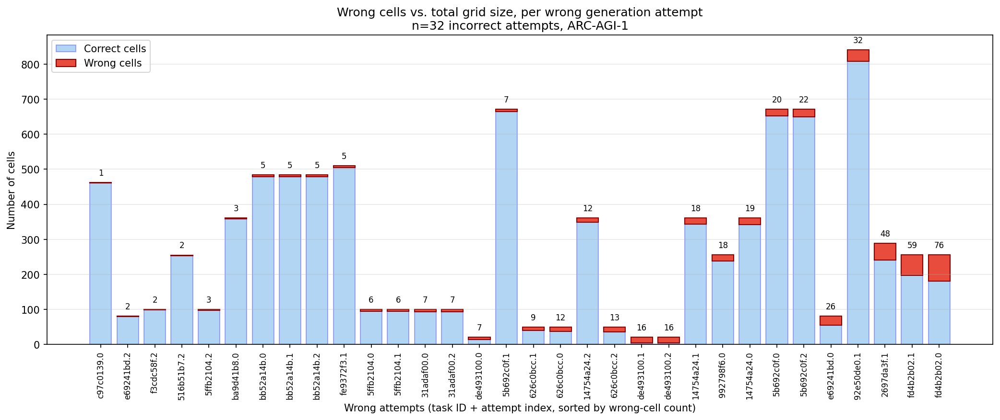
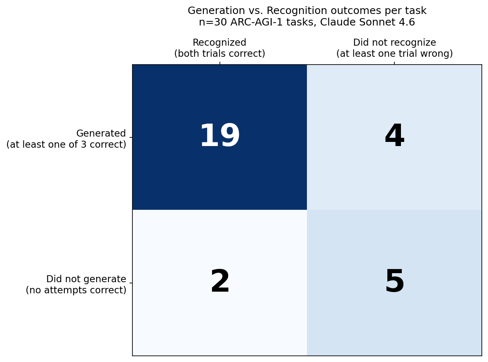
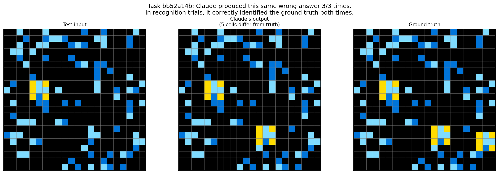
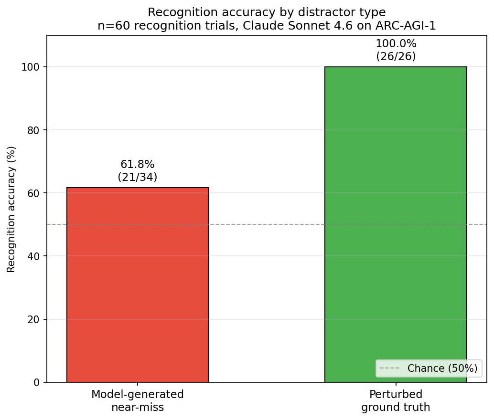

# Recognition vs. Generation on ARC-AGI-1: A Single-Model Study

*Jeremy Sakovich*

## Setup

ARC-AGI is a benchmark designed to test general reasoning capability in AI systems. Each task presents a few input-output pairs that demonstrate a transformation rule, and asks the test-taker to produce the correct output for a new input. ARC-AGI-1 (the original 2019 dataset) has been a primary measure of frontier-model reasoning capability for several years.

ARC Prize, the organization that maintains ARC-AGI and runs the public competition, scores submissions with a binary top-1 metric: each model's output either matches the ground truth exactly or it does not. The published leaderboard reports these binary scores by model. From an assessment-development standpoint, this is a thoughtfully-designed but minimal measurement methodology. Several measurement properties of the instrument are not well-characterized.

This study explores three. First, what does cell-level partial-credit scoring reveal that binary scoring obscures? Second, how does the model's ability to *recognize* a correct answer compare to its ability to *generate* one? Third, how much does the type of distractor used in a recognition task affect outcomes?

The study uses Claude Sonnet 4.6 on a 30-task sample from the ARC-AGI-1 public evaluation set. Generation was run with extended thinking enabled, three attempts per task. Recognition was tested with a 2-alternative forced choice paradigm, with distractors drawn either from the model's own wrong attempts or from controlled perturbations of the ground truth. Total cost was approximately $15.

Findings: cell-level Hamming similarity reveals that "wrong" generation attempts are often near-misses, half within 7 cells of correct on grids averaging 281 cells. A small recognition-generation gap is observable, with two specific cases (including one where the model could not generate any output) demonstrating that successful generation is not a prerequisite for successful recognition. Distractor type matters substantially: the model recognizes mechanical perturbations of ground truth perfectly (100%) but model-generated near-misses only 62% of the time, despite comparable surface similarity to ground truth.

Code, data, and analysis notebooks are in this repository. The full set of model outputs (90 generation attempts, 60 recognition trials, response text included) is released as a reusable artifact.

## Methods

**Sample.** The 400 tasks in the ARC-AGI-1 public evaluation set were stratified by maximum grid dimension into three buckets: small (max dim ≤ 10), medium (11-20), and large (21-30), containing 77, 205, and 118 tasks respectively. Ten tasks were sampled from each bucket using a fixed random seed, yielding a 30-task study sample with deliberate spread across grid sizes.

**Model.** All trials used Claude Sonnet 4.6 via the Anthropic API.

**Generation phase.** For each task, Claude was given the training input/output pairs and the test input, and asked to produce the correct test output. Three independent attempts were made per task at default temperature, yielding 90 generation trials. Prompts followed the minimal ARC Prize benchmarking template (no per-model scaffolding or chain-of-thought elicitation in the prompt itself). Extended thinking was enabled with an 8,000-token budget and a 16,000-token overall response cap. Responses were parsed by extracting the last JSON-formatted 2D array, using a parser adapted from ARC Prize's reference benchmarking implementation.

**Scoring.** Generation outputs were scored two ways. *Binary* scoring follows ARC convention: an output is correct only if it matches the ground truth exactly. *Cell-level Hamming similarity* reports the proportion of cells in the output grid that match the corresponding cells in the ground truth, when the two grids have the same dimensions; this captures partial credit but does not distinguish between near-miss execution errors and outputs that happen to share cells with the truth under a wrong rule.

One task (`e6de6e8f`) exhausted the 16,000-token budget on all three attempts without producing any output. It was retained in the recognition phase to test whether the model could discriminate the correct answer despite being unable to generate one.

**Recognition phase.** For each task, the model was presented with the original puzzle and two candidate answers, one correct and one incorrect, and asked to identify the correct one (2-alternative forced choice). Each task was run twice with positions counterbalanced, yielding 60 recognition trials. Extended thinking was disabled to measure discrimination capability rather than re-derivation; responses were elicited in an `<answer>X</answer>` tag format to ensure clean parsing. Format compliance was 100%.

**Distractors.** Distractor strategy was conditional on generation outcomes. For the 17 tasks where the model produced at least one parseable wrong attempt, the wrong attempt with the highest cell-Hamming similarity to ground truth was used as the distractor. For the 13 tasks where all three generation attempts were correct, a distractor was constructed by perturbing approximately 5% of cells in the ground truth grid, preserving the original color palette. Mean Hamming similarity of distractors to ground truth: 0.93 for model-generated, 0.97 for perturbations.

## Findings

**Finding 1.** Incorrect responses tend to be near misses when measured by cell-level Hamming similarity. The median wrong attempt missed by just 8 cells; half of all incorrect attempts were within 7 cells of being fully correct. Chart 1 shows the wrong-cell count for each of the 32 incorrect attempts, sorted ascending.

The closest near-miss was on task `c97c0139`, where the model produced an answer differing from ground truth by a single cell out of 462. The largest miss by raw cell count was `fd4b2b02`, where the model missed 76 cells out of 256. The lowest-Hamming attempt was on task `de493100`, where two of three attempts scored 0.20 (16 of 20 cells wrong on a small grid).

This distribution suggests at least two distinct kinds of failure can be drawn out from near-miss analysis in addition to the binary "incorrect" analysis.

*Misses with proportionally few cells incorrect* are consistent with the model having inferred something close to the correct rule but failing to apply it without error. These could be execution slips. Humans make analogous mistakes routinely: a student who gets all the digits correct but puts the decimal point in the wrong place (3483.7856 vs. 348.37856), or a typo that produces "pwn" instead of "own." The correct answer is known, but it is not faithfully demonstrated, so it can not be properly assessed.

*Misses with a higher proportion of incorrect cells* are more consistent with rule-misidentification. There are several ways this might go: the model might apply a coherent but incorrect rule (analogous to a student who reads "2 + 4" as "2 - 4"), it might combine a partial inference with speculative filler, or it might be guessing in a way not grounded in the training data. The data here can not distinguish among these. Characterizing them at scale would be a useful follow-up.

What is clear is that binary scoring conflates these states. From a measurement standpoint, an attempt that misses by one cell out of 462 and an attempt that misses 80% of cells on a small grid are different events.

**Finding 2.** A small recognition-generation gap is present. Across 30 tasks, the four-quadrant cross-tabulation in Chart 2 shows two tasks where the model failed to generate the correct answer in any of three attempts but recognized it correctly in both recognition trials. Two of 30 is a small absolute count, and statistical claims at this scale are thin, but each individual case is striking.

`e6de6e8f`: no response was generated at all. The token budget was exhausted on all three attempts before the model produced any output. Yet when shown the correct answer alongside a mechanically generated distractor, the model identified the correct one in both trials. This is the strongest possible demonstration of a recognition-generation gap: successful generation is not a prerequisite for successful discrimination.

One reading of `e6de6e8f` is that the model, once shown candidate answers, was able to reason backward by comparing each candidate to the pattern in the training outputs. With both candidates visible, and the knowledge that one is correct, the model can verify which option correctly applies the inferred pattern to the test input. That is a much smaller cognitive burden than producing the candidate from scratch.

`bb52a14b`: the model produced an identical incorrect output on all three generation attempts, missing on 5 cells out of 484, but it recognized the correct answer in both recognition trials. Chart 4 shows this case visually: the model failed to recognize that a specific 3x3 subgrid repeats around an L-shaped light blue pattern wherever that pattern appears in the input. The model converged on the same partial understanding of the rule three times. When shown its own incorrect answer next to the correct answer, it consistently picked the correct one.

These findings have broader implications. Several approaches to improving model performance on hard reasoning tasks rely on the model being a better discriminator than generator: sampling many candidates and selecting the best, scaffolded search, verifier-based rejection sampling. Even at this small scale, the gap between what Claude can generate and what it can recognize is observable.

**Finding 3.** Distractor type matters substantially. Chart 3 shows recognition accuracy split by distractor source: 100% (26/26) on perturbation distractors, 61.8% (21/34) on distractors drawn from the model's own wrong attempts. Despite both distractor types having similar Hamming similarity to ground truth (0.97 for perturbations vs. 0.93 for model attempts), the difference in recognition accuracy is large.

Hamming similarity does not by itself explain distractor difficulty. The model's wrong attempts have some other property that makes them harder to discriminate from correct answers. One reading: model-generated wrongs encode coherent if incorrect interpretations of the puzzle's rule, while mechanical perturbations do not. Perturbations are inconsistent with any rule the model would seriously entertain, so they are detected as wrong almost immediately. The model's own wrongs follow a plausible-but-wrong rule, and the model can not reliably discriminate them from the correct answer.

This suggests a question worth investigating. Human reasoning errors occur in patterned ways to such an extent that there are well-known classes of them: red herring, affirming the consequent, denying the antecedent, hasty generalization. It is well known that generative models make mistakes, but it is possible that frontier models make patterned reasoning errors of their own on tasks of this kind. Perhaps Claude is susceptible to a set of "ARC fallacies" when reasoning about these puzzles, and perhaps those patterns can be identified, named, and corrected. The data is suggestive rather than conclusive: of the four tasks where the model generated correctly but failed to recognize, two showed consistent preference for the model's own wrong answer regardless of position (a self-evaluation failure on those tasks), and two showed a same-letter response pattern that is ambiguous at this trial count.

A more cautious framing is that the model readily recognizes errors that are not its own but struggles to recognize its own errors. That is a finding about *self-evaluation*, not just recognition, and it connects to the active research question of whether a model can serve as its own verifier.

## Limitations

This is a small, single-model, exploratory study. Several constraints affect how strongly the findings can be claimed.

**Sample size.** Thirty tasks from ARC-AGI-1 is a small slice of a 400-task evaluation set. The recognition-generation gap finding rests on n=2 cases. The patterns identified in distractor-source asymmetry are clearer (60 trials, 30 tasks), but extending to a full eval set or multiple models would tighten any claim about generality.

**Single model, single configuration.** All trials used Claude Sonnet 4.6 with one reasoning configuration per phase (extended thinking on for generation, off for recognition). The findings here are about one model's behavior under one set of conditions. Whether other frontier models show similar patterns, or whether the gap changes under different reasoning budgets, is unknown.

**Distractor difficulty was not formally controlled.** Perturbation distractors and model-generated distractors had similar mean Hamming similarity to ground truth, but the two types differ on other properties (the model-generated wrongs preserve the original color palette only 88% of the time and counts 19% of the time; perturbations preserve both by construction). The 100% versus 62% recognition gap could reflect differences along dimensions that were not directly measured.

**Cell-level Hamming is an imperfect partial-credit measure.** It captures position-wise agreement but does not distinguish between near-miss execution errors and outputs that happen to share many cells with the truth under a different rule. Stronger partial-credit measurement would require coding the model's outputs against the rule each task is meant to test.

**Recognition was elicited with answer-tag format.** With extended thinking disabled, the model continued to reason in the visible response. The answer-tag format ensured clean parsing but is itself a form of prompt engineering. The recognition condition measured here is "no extended thinking, structured answer format," not "no reasoning at all."

## Future work

A handful of natural extensions would address most of the limitations above.

**Multi-model replication.** Running the same methodology across several frontier models from different families would show whether the recognition-generation gap and the distractor-source asymmetry are properties of Claude specifically or general features of current frontier models. Multi-model data also enables proper psychometric analysis (item response theory, item-level differential functioning, test reliability estimates) that a single-model study can not support.

**Controlled distractor difficulty.** A follow-up could systematically vary distractor type (perturbations of multiple kinds, model-generated wrongs, hand-crafted distractors targeting specific failure modes, distractors drawn from related tasks) at matched Hamming similarity. The question becomes: what specifically makes a distractor confusable, beyond surface similarity?

**The "ARC fallacies" question.** The hypothesis that frontier models exhibit patterned reasoning errors on ARC-style tasks would benefit from larger-scale qualitative analysis of model wrong attempts. Coding wrong attempts by the kind of rule-error they exhibit, then characterizing which kinds of errors occur most frequently and which kinds confuse the model most as distractors, would test whether identifiable error patterns exist.

**Self-evaluation more deeply.** The two cases where the model preferred its own wrong answer over the truth across both position arrangements are interesting and underexplored. Why does the model evaluate its own wrongs as more correct than the actual answer? Confidence in the inferred rule? Structural coherence the actual answer does not exhibit? This connects to active research on model calibration and self-knowledge.

**Reasoning-level variation.** Generation used extended thinking and recognition did not. The full space of (generation thinking budget) × (recognition thinking budget) is unexplored here. Varying both would map out how reasoning effort interacts with each capability.

**Extension to ARC-AGI-2.** The methodology applies directly to the harder benchmark. Whether the recognition-generation gap is more pronounced there (since generation is harder) or whether recognition also degrades is an empirical question.

More broadly, several measurement-theoretic concepts standard in human-assessment work, such as item response theory, differential item functioning, and test reliability under repeated administration, are underexplored in LLM evaluation despite their direct relevance. The methodology in this study is a small step in that direction; substantially more work along these lines seems warranted.

## Reproduction

All code, data, and analysis notebooks are in this repository. To reproduce:

1. Clone this repo and the [ARC-AGI repository](https://github.com/fchollet/ARC-AGI) as a sibling folder.
2. Create a virtual environment and install dependencies: `pip install -r requirements.txt`.
3. Add an Anthropic API key to a local `.env` file: `ANTHROPIC_API_KEY=sk-ant-...`.
4. Run the notebook end-to-end. Total API cost is approximately $15 with the configuration in the code.

The full set of model outputs (90 generation attempts, 60 recognition trials, including raw response text and reasoning traces) is included in `data/`. The data is released under the MIT license (see `LICENSE`); reuse and extension are encouraged.
